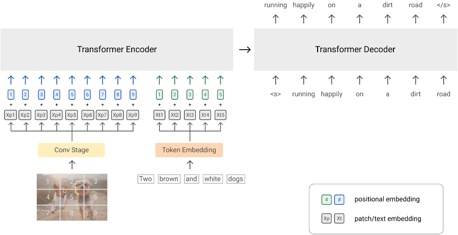

## SimVLM

## Introduction
This is an unofficial PyTorch Implementation of [SimVLM: Simple Visual Language Model Pretraining with Weak Supervision](https://arxiv.org/abs/2108.10904) This repo is mainly based on[transformers](https://github.com/huggingface/transformers), especially its [ViT](https://github.com/huggingface/transformers/tree/main/src/transformers/models/vit) and [ViLT](https://github.com/huggingface/transformers/tree/main/src/transformers/models/vilt) implementations

